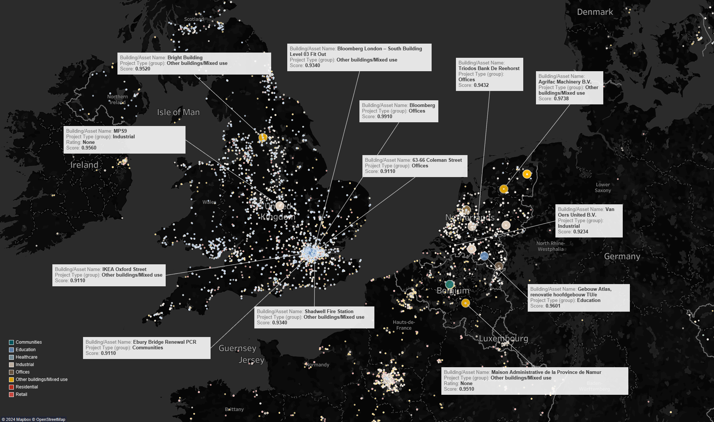
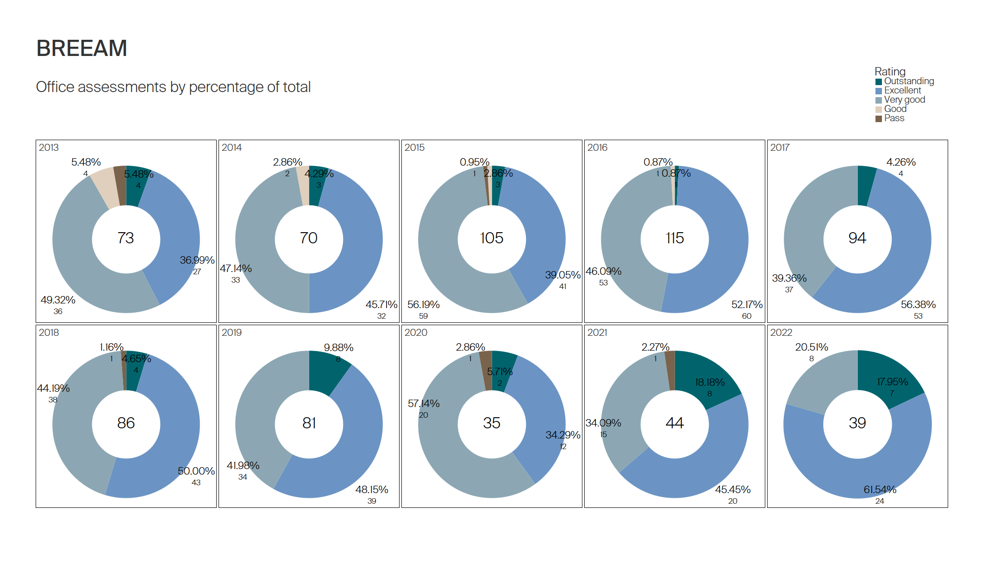

# $\color{red}{\textsf{[DRAFT]}}$

# Scraping Certified BREEAM Assessments Data

## Introduction
Sustainability in design and construction has become a critical focus in contemporary building practices, with various frameworks developed to assess environmental performance. One such framework, the Building Research Establishment Environmental Assessment Method (BREEAM), provides an internationally recognized certification system for evaluating the sustainability of buildings based on factors such as energy efficiency, water usage, and pollution reduction. Compared to other certification schemes like LEED (Leadership in Energy and Environmental Design) or WELL, BREEAM is particularly influential in the UK and Europe, where it helps shape green building practices.

This study employs data science techniques to scrape, process, and analyze publicly available data on BREEAM-certified assessments. By extracting detailed data from the GreenBookLive database, we aim to uncover trends and patterns across various regions, building types, and certification levels, providing insights that could guide future green building policies and practices.

## Project Objective
The primary objective of this study is to systematically extract and analyze data on BREEAM-certified buildings from the GreenBookLive database. The analysis focuses on:

- Tracking temporal changes in the number of certified buildings.
- Examining sectoral and typological distributions of buildings with BREEAM certifications.
- Identifying regional trends and geographic concentrations of certified buildings.
- Providing data-driven insights for architects, developers, and policymakers to support informed decision-making in sustainable construction.

This study covers approximately 40,000 certified assessments, spanning various building types, sectors, and regions across the UK, with the goal of uncovering spatial and temporal trends in sustainable construction.

Figure 1. xxx.  

## Relevance of the Study
As sustainability metrics become a standard part of architectural practice, it is essential to analyze the proliferation of BREEAM certifications to better understand the progress of green building initiatives. This study provides a quantitative approach to tracking certification trends over time, visualizing regional disparities, and assessing which sectors are most aligned with sustainable practices.

Given the UK’s ambitious net-zero goals, analyzing BREEAM certifications offers valuable insights for architects, urban planners, and policymakers. This research also aligns with government initiatives like the UK Green Building Council’s roadmap for sustainability, making the findings particularly relevant to ongoing legislative efforts.

Figure 2. xxx 

Figure 3. xxx 

Figure 4. xxx  

Figure 5. xxx 

Figure 6. xxx 

Figure 7. xxx 

## Methodology

### Web-Scraping Process
The data extraction process involved web scraping techniques to retrieve BREEAM certification data from the GreenBookLive database. The dynamic nature of the site required a combination of HTTP requests and browser automation via Selenium to interact with and retrieve data from dynamically loaded content.

**Technologies Used**: The web scraping pipeline was implemented using Python’s requests library for static data extraction and Selenium for simulating browser interactions to handle dynamic web elements.

**Certification Overview**: According to the GreenBookLive FAQ, only products and services that have undergone third-party certification—the highest level of assurance that sustainability standards are consistently met—are listed. This type of certification differs from simple testing, as it involves ongoing audits and testing to ensure continued compliance. GreenBookLive typically requires certification bodies to be accredited by recognized organizations like the UK Accreditation Service (UKAS), ensuring the competence and impartiality of the listed certifications.

**Data Fields**: Key data fields extracted included building name, location (city, region), certification date, assessor information, and certification level (e.g., “Excellent,” “Very Good”).

**Challenges in Scraping**: Due to the site’s dynamic content loading, extensive use of HTML parsing and interaction simulation was necessary. Rate-limiting mechanisms were implemented to prevent overloading the web server and avoid IP blocking. Ethical considerations were also taken into account by respecting GreenBookLive's terms of service.

### Data Cleaning & Processing
Once extracted, the raw data required significant preprocessing before analysis:

- **Data Cleaning**: Using Pandas, the data was cleaned by removing duplicates, standardizing location formats (e.g., ensuring consistency in UK region names), and resolving inconsistencies in date formats. Missing or incomplete data entries were handled through imputation or exclusion based on predefined thresholds. For example, missing location data was imputed based on known regional clusters of BREEAM-certified buildings, while incomplete date fields were excluded from time-series analysis.
- **Categorization**: The dataset was categorized by building type (residential, commercial, public infrastructure) and region to facilitate both temporal and spatial comparative analysis.

### Exploratory Data Analysis (EDA)
Exploratory Data Analysis was performed to uncover patterns and trends in the BREEAM certifications dataset:

- **Temporal Trends**: Time-series analysis was conducted to track changes in certification counts over the years, revealing notable spikes in certifications during years with significant regulatory changes (e.g., revisions to the UK Building Regulations). Certification levels such as “Excellent” and “Outstanding” showed a marked increase in recent years, reflecting industry shifts toward higher sustainability standards.
- **Sectoral and Geographic Analysis**: Data was segmented by building type and region to identify concentrations of certified buildings. Visualizations, including bar charts and histograms, were generated using Matplotlib and Seaborn to illustrate these distributions. For instance, commercial buildings dominated certifications in London, while residential buildings showed a surge in the North West of England, particularly in city-regeneration areas.
- **Geospatial Visualization**: Using Folium and GeoPandas, geospatial analysis was performed to visualize certification densities across the UK. The analysis highlighted hotspots in London and the South East, with emerging clusters in Scotland and the North West, particularly in regions undergoing urban renewal.

### Cluster Analysis with Machine Learning
To provide a more nuanced understanding of the relationships between building type, certification levels, and geographic distribution, unsupervised learning techniques were employed:

- **K-Means Clustering**: A K-means clustering algorithm was applied to group buildings based on certification level, type, and location. This revealed distinct clusters of high-performing commercial buildings in central London and emerging residential clusters in northern regions. The analysis also showed that public infrastructure projects (e.g., schools, hospitals) tend to be clustered in Scotland and Wales, where public sector green initiatives are prominent.
- **Feature Engineering**: Features such as certification rating, building type, geographic coordinates, and year of certification were selected as input variables for clustering. These features were standardized to ensure uniformity across the dataset.
- **Evaluation of Clusters**: The optimal number of clusters was determined using the Elbow Method and silhouette scores. Cluster centroids provided insights into regional disparities, with specific clusters indicating higher sustainability standards in certain sectors, such as education and healthcare in Scotland.

## Challenges Encountered
Several challenges were faced during the project:

- **Dynamic Content Loading**: The use of Selenium was crucial for navigating JavaScript-rendered content. However, the reliance on browser automation introduced complexity, requiring careful handling of page loading times and DOM element interactions.
- **Data Quality Issues**: The dataset exhibited inconsistencies, particularly in location formatting and date records. For example, some records lacked clear geographic details, which required extensive cleaning. Additionally, different regions used slightly different nomenclatures, further complicating data standardization.
- **Rate Limiting and Scalability**: The frequency of HTTP requests was carefully throttled to avoid IP blocking or overloading the server. This challenge, along with error handling for intermittent page failures, slowed the scraping process and required re-running scripts multiple times for comprehensive data collection.

## Key Insights

- **Temporal Certification Trends**: The analysis revealed a steady increase in the number of buildings receiving BREEAM certifications over the past five years, with a notable surge in certifications at higher levels (e.g., “Excellent” and “Outstanding”). The number of certifications doubled between 2018 and 2023, coinciding with increased regulatory pressure and industry commitment to sustainability.
- **Regional Disparities**: Geospatial analysis showed that London and the South East continue to lead in the number of certified buildings, though there is growing momentum in Scotland and the North West, particularly in post-industrial cities like Manchester and Liverpool. These regions are emerging as sustainability hotspots, driven by local government initiatives.
- **Sectoral Breakdown**: Commercial and residential buildings accounted for the majority of certifications. However, the public sector, particularly infrastructure projects such as schools and healthcare facilities, showed a notable uptick in certifications in Scotland and Wales, where government incentives have spurred sustainable development.

## Conclusions
This study underscores the importance of data-driven approaches in understanding the evolving landscape of sustainable construction. The growth in BREEAM certifications, particularly at higher levels, suggests an increasing industry commitment to sustainability. The regional disparities highlight the need for targeted policies and incentives to promote green building practices in underrepresented areas. These findings are particularly relevant as the UK moves toward its net-zero goals.

Future research could explore the impact of regulatory changes on certification rates and expand the analysis to other global sustainability frameworks, such as LEED or WELL, to enable cross-comparative studies.

## Technical Details for Scraping

**Libraries Used**:

- requests for HTTP requests and data extraction.
- BeautifulSoup for HTML parsing and data field extraction.
- Selenium for simulating user interaction and handling dynamic content.
- Pandas for data cleaning, manipulation, and analysis.
- Folium and GeoPandas for geospatial analysis and visualization.

**Scraping Workflow**:

- The process involved fetching raw HTML using requests and rendering dynamic content via Selenium.
- HTML tags corresponding to relevant data fields were identified, and extracted data was stored in a structured format. For example, building name, certification level, and assessor information were scraped and organized into a DataFrame.
- Error handling and request throttling were incorporated to ensure reliable and ethical scraping.

The entire scraping process took approximately one week due to throttling and data cleaning, balancing efficiency with data integrity.

## Further Directions
This research serves as a foundational exploration of BREEAM certifications, opening avenues for future work. Potential directions include:

- Extending the analysis to other sustainability certification frameworks, such as LEED or WELL, to enable comparative studies.
- Conducting longitudinal studies to assess the correlation between policy changes and certification rates.
- Utilizing more advanced machine learning techniques, such as hierarchical clustering or neural networks, to gain deeper insights into certification patterns.

