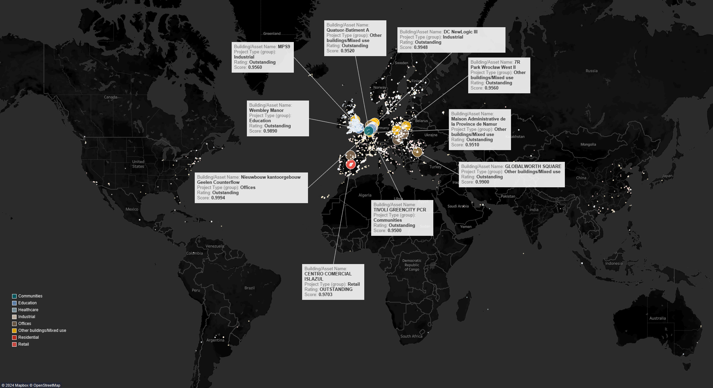
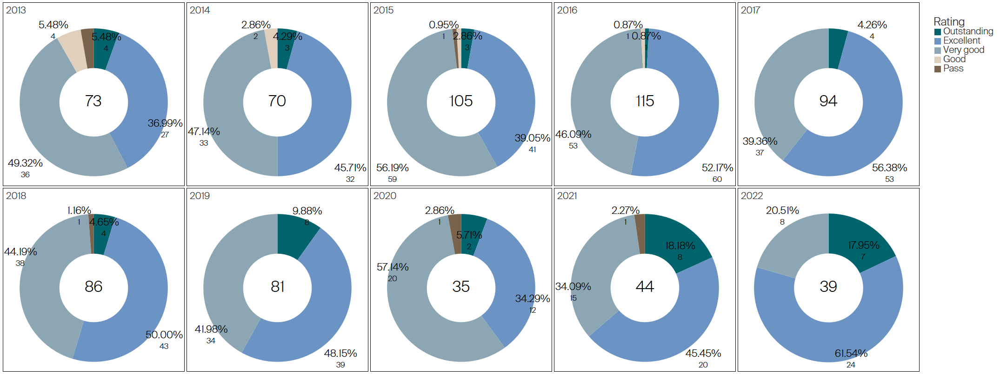
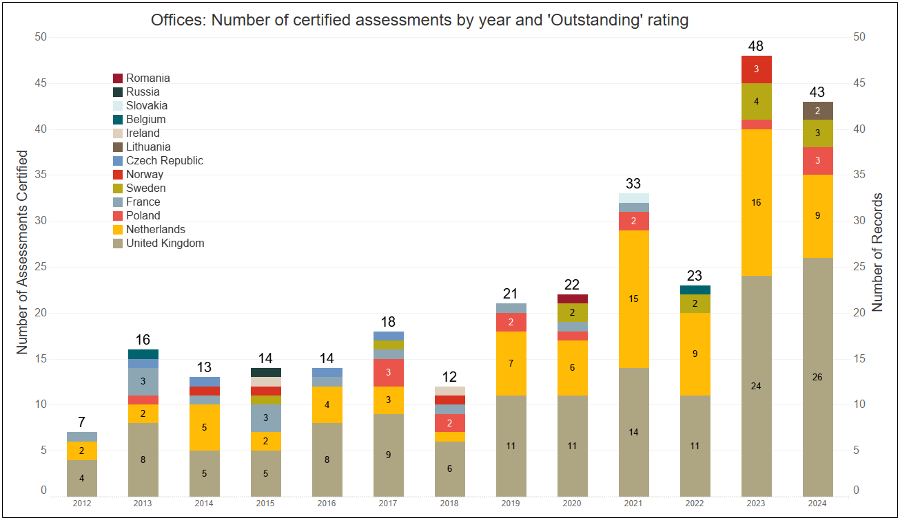
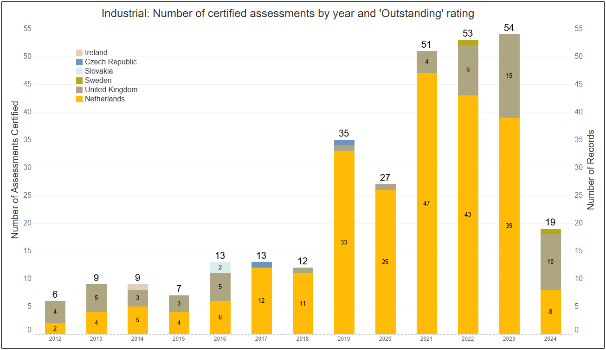

# $\color{red}{\textsf{[DRAFT]}}$

# Scraping Certified BREEAM Assessments Data

## Introduction
Sustainability in design and construction has become a critical focus in contemporary building practices, with various frameworks developed to assess environmental performance. One such framework, the Building Research Establishment Environmental Assessment Method (BREEAM), provides an internationally recognized certification system for evaluating the sustainability of buildings based on factors such as energy efficiency, water usage, and pollution reduction. Compared to other certification schemes like LEED (Leadership in Energy and Environmental Design) or WELL, BREEAM is particularly influential in the UK and Europe, where it helps shape green building practices.

This study employs data science techniques to scrape, process, and analyze publicly available data on BREEAM-certified assessments. By extracting detailed data from the GreenBookLive database, we aim to uncover trends and patterns across various regions, building types, and certification levels, providing insights that could guide future green building policies and practices.

## Project Objective
The primary objective of this study is to systematically extract and analyze data on BREEAM-certified buildings from the GreenBookLive database. The analysis focuses on:

- Tracking temporal changes in the number of certified buildings.
- Examining sectoral and typological distributions of buildings with BREEAM certifications.
- Identifying regional trends and geographic concentrations of certified buildings.
- Providing data-driven insights for architects, developers, and policymakers to support informed decision-making in sustainable construction.

This study covers approximately 40,000 certified assessments, spanning various building types, sectors, and regions across the UK, with the goal of uncovering spatial and temporal trends in sustainable construction.

Figure 1. xxx.  

## Relevance of the Study
As sustainability metrics become a standard part of architectural practice, it is essential to analyze the proliferation of BREEAM certifications to better understand the progress of green building initiatives. This study provides a quantitative approach to tracking certification trends over time, visualizing regional disparities, and assessing which sectors are most aligned with sustainable practices.

Given the UK’s ambitious net-zero goals, analyzing BREEAM certifications offers valuable insights for architects, urban planners, and policymakers. This research also aligns with government initiatives like the UK Green Building Council’s roadmap for sustainability, making the findings particularly relevant to ongoing legislative efforts.

Figure 2. xxx 

Figure 3. xxx 

Figure 4. xxx  

Figure 5. xxx 

Figure 6. xxx 

Figure 7. xxx 

## Methodology

### Web-Scraping Process
The data extraction process involved web scraping techniques to retrieve BREEAM certification data from the GreenBookLive database. The dynamic nature of the site required a combination of HTTP requests and browser automation via Selenium to interact with and retrieve data from dynamically loaded content.

**Technologies Used**: The web scraping pipeline was implemented using Python’s requests library for static data extraction and Selenium for simulating browser interactions to handle dynamic web elements.

**Certification Overview**: According to the GreenBookLive FAQ, only products and services that have undergone third-party certification—the highest level of assurance that sustainability standards are consistently met—are listed. This type of certification differs from simple testing, as it involves ongoing audits and testing to ensure continued compliance. GreenBookLive typically requires certification bodies to be accredited by recognized organizations like the UK Accreditation Service (UKAS), ensuring the competence and impartiality of the listed certifications.

**Data Fields**: Key data fields extracted included building name, location (city, region), certification date, assessor information, and certification level (e.g., “Excellent,” “Very Good”).

**Challenges in Scraping**: Due to the site’s dynamic content loading, extensive use of HTML parsing and interaction simulation was necessary. Rate-limiting mechanisms were implemented to prevent overloading the web server and avoid IP blocking. Ethical considerations were also taken into account by respecting GreenBookLive's terms of service.

### Data Cleaning & Processing
Once extracted, the raw data required significant preprocessing before analysis:

- **Data Cleaning**: Using Pandas, the data was cleaned by removing duplicates, standardizing location formats (e.g., ensuring consistency in UK region names), and resolving inconsistencies in date formats. Missing or incomplete data entries were handled through imputation or exclusion based on predefined thresholds. For example, missing location data was imputed based on known regional clusters of BREEAM-certified buildings, while incomplete date fields were excluded from time-series analysis.
- **Categorization**: The dataset was categorized by building type (residential, commercial, public infrastructure) and region to facilitate both temporal and spatial comparative analysis.

### Exploratory Data Analysis (EDA)
Exploratory Data Analysis was performed to uncover patterns and trends in the BREEAM certifications dataset:

- **Temporal Trends**: Time-series analysis was conducted to track changes in certification counts over the years, revealing notable spikes in certifications during years with significant regulatory changes (e.g., revisions to the UK Building Regulations). Certification levels such as “Excellent” and “Outstanding” showed a marked increase in recent years, reflecting industry shifts toward higher sustainability standards.
- **Sectoral and Geographic Analysis**: Data was segmented by building type and region to identify concentrations of certified buildings. Visualizations, including bar charts and histograms, were generated using Matplotlib and Seaborn to illustrate these distributions. For instance, commercial buildings dominated certifications in London, while residential buildings showed a surge in the North West of England, particularly in city-regeneration areas.
- **Geospatial Visualization**: Using Folium and GeoPandas, geospatial analysis was performed to visualize certification densities across the UK. The analysis highlighted hotspots in London and the South East, with emerging clusters in Scotland and the North West, particularly in regions undergoing urban renewal.

### Cluster Analysis with Machine Learning
To provide a more nuanced understanding of the relationships between building type, certification levels, and geographic distribution, unsupervised learning techniques were employed:

- **K-Means Clustering**: A K-means clustering algorithm was applied to group buildings based on certification level, type, and location. This revealed distinct clusters of high-performing commercial buildings in central London and emerging residential clusters in northern regions. The analysis also showed that public infrastructure projects (e.g., schools, hospitals) tend to be clustered in Scotland and Wales, where public sector green initiatives are prominent.
- **Feature Engineering**: Features such as certification rating, building type, geographic coordinates, and year of certification were selected as input variables for clustering. These features were standardized to ensure uniformity across the dataset.
- **Evaluation of Clusters**: The optimal number of clusters was determined using the Elbow Method and silhouette scores. Cluster centroids provided insights into regional disparities, with specific clusters indicating higher sustainability standards in certain sectors, such as education and healthcare in Scotland.

## Challenges Encountered
Several challenges were faced during the project:

- **Dynamic Content Loading**: The use of Selenium was crucial for navigating JavaScript-rendered content. However, the reliance on browser automation introduced complexity, requiring careful handling of page loading times and DOM element interactions.
- **Data Quality Issues**: The dataset exhibited inconsistencies, particularly in location formatting and date records. For example, some records lacked clear geographic details, which required extensive cleaning. Additionally, different regions used slightly different nomenclatures, further complicating data standardization.
- **Rate Limiting and Scalability**: The frequency of HTTP requests was carefully throttled to avoid IP blocking or overloading the server. This challenge, along with error handling for intermittent page failures, slowed the scraping process and required re-running scripts multiple times for comprehensive data collection.

## Key Insights

- **Temporal Certification Trends**: The analysis revealed a steady increase in the number of buildings receiving BREEAM certifications over the past five years, with a notable surge in certifications at higher levels (e.g., “Excellent” and “Outstanding”). The number of certifications doubled between 2018 and 2023, coinciding with increased regulatory pressure and industry commitment to sustainability.
- **Regional Disparities**: Geospatial analysis showed that London and the South East continue to lead in the number of certified buildings, though there is growing momentum in Scotland and the North West, particularly in post-industrial cities like Manchester and Liverpool. These regions are emerging as sustainability hotspots, driven by local government initiatives.
- **Sectoral Breakdown**: Commercial and residential buildings accounted for the majority of certifications. However, the public sector, particularly infrastructure projects such as schools and healthcare facilities, showed a notable uptick in certifications in Scotland and Wales, where government incentives have spurred sustainable development.

## Conclusions
This study underscores the importance of data-driven approaches in understanding the evolving landscape of sustainable construction. The growth in BREEAM certifications, particularly at higher levels, suggests an increasing industry commitment to sustainability. The regional disparities highlight the need for targeted policies and incentives to promote green building practices in underrepresented areas. These findings are particularly relevant as the UK moves toward its net-zero goals.

Future research could explore the impact of regulatory changes on certification rates and expand the analysis to other global sustainability frameworks, such as LEED or WELL, to enable cross-comparative studies.

## Technical Details for Scraping

**Libraries Used**:

- requests for HTTP requests and data extraction.
- BeautifulSoup for HTML parsing and data field extraction.
- Selenium for simulating user interaction and handling dynamic content.
- Pandas for data cleaning, manipulation, and analysis.
- Folium and GeoPandas for geospatial analysis and visualization.

**Scraping Workflow**:

- The process involved fetching raw HTML using requests and rendering dynamic content via Selenium.
- HTML tags corresponding to relevant data fields were identified, and extracted data was stored in a structured format. For example, building name, certification level, and assessor information were scraped and organized into a DataFrame.
- Error handling and request throttling were incorporated to ensure reliable and ethical scraping.

The entire scraping process took approximately one week due to throttling and data cleaning, balancing efficiency with data integrity.

## Further Directions
This research serves as a foundational exploration of BREEAM certifications, opening avenues for future work. Potential directions include:

- Extending the analysis to other sustainability certification frameworks, such as LEED or WELL, to enable comparative studies.
- Conducting longitudinal studies to assess the correlation between policy changes and certification rates.
- Utilizing more advanced machine learning techniques, such as hierarchical clustering or neural networks, to gain deeper insights into certification patterns.

---

---

# Data Science Research Project Accelerator: Scraping BREEAM Data

---

### **Project Objective:**
The primary goal of this project is to scrape, process, and analyze publicly available BREEAM-certified assessment data to uncover insights into the proliferation of sustainable construction across various regions, building types, and certification levels. By automating data extraction from GreenBookLive, the objective is to:
1. Track temporal changes in BREEAM certifications.
2. Examine sector-specific and typological distribution patterns.
3. Identify regional trends in certified sustainable buildings.
4. Provide actionable insights for architects, developers, and policymakers to support sustainable construction decisions.

This project specifically focuses on high-performance certifications, such as "Outstanding" and "Excellent," to help guide green building initiatives in line with the UK's ambitious net-zero targets.

---

### **Relevance of the Study:**
Sustainability in the built environment is gaining importance as urban areas grow and green standards are increasingly embedded in development projects. BREEAM certification plays a critical role in ensuring that sustainability standards are maintained. Understanding the distribution of certified buildings will inform future urban policies, building designs, and regional planning strategies. The insights gained from this project are crucial for:
- Policy development for green infrastructure.
- Incentive programs to promote high sustainability standards in construction.
- Identifying regional disparities in BREEAM certifications to focus resources on underperforming areas.

---

### **Methodology:**

1. **Data Collection:**
   - **Web-Scraping:** Data was extracted using Python libraries such as `requests`, `BeautifulSoup`, and `Selenium`. The latter was especially useful in interacting with dynamically loaded web elements. The data included:
     - Building name
     - Location (city, region)
     - Certification date
     - Certification level (e.g., Excellent, Outstanding)
   - **Challenges in Scraping:** Handling JavaScript-rendered content required advanced interaction simulations. The scraping process was throttled to avoid overloading the server and risking IP blocking.

2. **Data Cleaning:**
   - Data inconsistencies, such as different regional nomenclatures and missing fields, were addressed using the `Pandas` library. Imputation was used for missing geographical data based on regional trends.
   - Certification types were standardized for a clean comparison across regions and years.

3. **Data Analysis:**
   - **Temporal Trends:** Using time-series analysis, certification rates were compared over years to identify spikes and drops, particularly around regulatory shifts. Certifications for higher levels like "Outstanding" showed a marked increase, particularly from 2019 onwards (as shown in the *Outstanding Industrial* and *Office* charts).
   - **Sectoral and Geographic Distribution:** Geospatial analysis was done with `Folium` and `GeoPandas`, revealing clusters of certified buildings in London, Manchester, and emerging areas in Scotland (e.g., *Map UK* and *Map London*). Sector-wise, the office, retail, and residential sectors dominated certifications, with industrial and public sectors growing in recent years (*Land Use Percentage*).

4. **Model Building:**
   - **K-Means Clustering:** This unsupervised technique was used to group buildings based on certification type, region, and building type. It revealed key clusters in high-performing areas such as Central London and emerging northern regions like Manchester and Liverpool (*Map World*).
   - **Cluster Evaluation:** The Elbow Method and silhouette scores were used to optimize the number of clusters. Key cluster centroids highlighted that public infrastructure projects like schools and hospitals in Wales and Scotland often pursued higher sustainability standards.

5. **Technology and Innovation:**
   - **Visualization Tools:** `Matplotlib` and `Seaborn` were employed for bar charts, histograms, and distribution visualizations. Geospatial insights were mapped using `Folium`, bringing to light certification density across regions.
   - **Machine Learning:** Beyond clustering, feature engineering (based on certification year, type, and location) enriched the dataset for deeper insights into sustainability performance.

---

### **Challenges:**
- **Dynamic Content Loading:** The heavy reliance on JavaScript necessitated Selenium automation, which introduced complications in terms of page load times and ensuring reliable interactions with HTML elements.
- **Data Quality Issues:** Regional discrepancies in naming conventions (e.g., UK counties) required extensive cleaning and standardization efforts.
- **Rate Limiting and Scalability:** HTTP request throttling was essential to avoid server overload, leading to longer scraping durations.

---

### **Stakeholder Engagement:**
This project is designed with policymakers, architects, and urban planners in mind. Engaging these stakeholders at key phases of the project—particularly when reviewing geospatial and temporal findings—ensured the insights were aligned with real-world needs. Stakeholder feedback on initial clustering results and geographic disparities informed further model refinement.

---

### **Key Insights:**
- **Surge in Certifications:** There was a doubling of BREEAM certifications at "Outstanding" and "Excellent" levels between 2018 and 2023, likely driven by more stringent regulations and increased sustainability awareness (*Outstanding Certifications Chart*).
- **Regional Disparities:** While London remains the leader in certifications, post-industrial cities like Manchester and regions in Scotland showed significant growth, driven by government initiatives and urban regeneration efforts.
- **Sectoral Growth:** Offices and retail projects remain the dominant sectors for certifications. However, there is a noticeable uptick in the public sector, particularly in healthcare and educational buildings in northern regions.

---

### **Ethical Considerations:**
Web scraping was conducted ethically, following GreenBookLive’s terms of service, ensuring minimal server load through request throttling, and respecting the privacy of data not intended for public access. The data extracted was limited to publicly available certification records.

---

### **Conclusions:**
This research provided valuable insights into the growth and distribution of BREEAM-certified buildings, highlighting regional and sectoral trends that can inform future sustainability initiatives. The clustering analysis suggested targeted incentives may be necessary for underperforming regions, and public infrastructure projects should receive continued support for green certifications.

Future research should expand to include global certifications like LEED or WELL, offering a cross-comparative analysis to further promote global sustainability standards.

---

### **Hands-On Activity:**
Using a subset of the scraped data, a mini-research project was conducted to analyze certification rates in industrial buildings across regions. The findings, as visualized in the *Industrial Certifications Chart*, reinforced the temporal trends and sectoral shifts toward higher certification levels.

---

### **Presentation:**
A comprehensive proposal presentation was created, detailing the project objectives, methodologies, challenges, and key findings. The visualizations (as presented in *Map UK*, *Land Use Percentage*, and *Office Certifications*) were central in communicating the spatial and sectoral distribution of BREEAM certifications.

--- 

