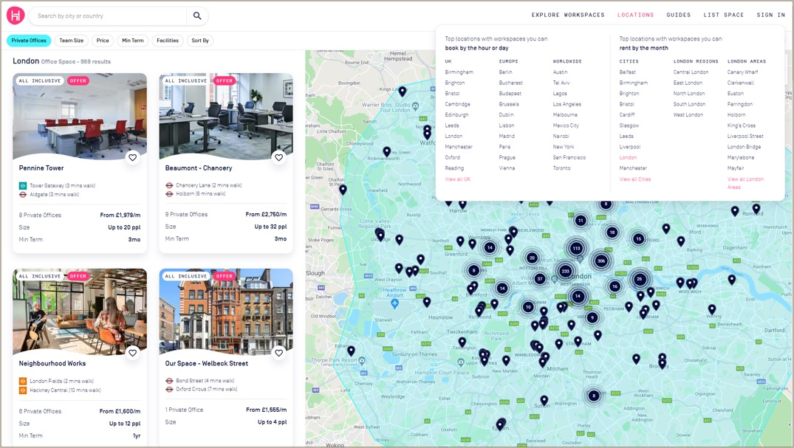

# $\color{red}{\textsf{[DRAFT]}}$

# Scraping HubbleHQ: A Data-Driven Exploration of London’s Office Rental Market

## Introduction
As part of an office development project in Westminster, accurate data on local office rentals was essential. Traditional datasets were either incomplete or outdated, so I employed web scraping to collect up-to-date information from platforms like HubbleHQ. The project aimed to compile key metrics such as rent prices, desk availability, and spatial configurations, allowing for data-driven decision-making.

### Objectives
- Gather real-time data on office rental spaces in Westminster and other London areas.
- Extract fields such as monthly rent, number of desks, and area size to assess trends.
- Utilize Python’s web scraping libraries to achieve an efficient, repeatable process.

*Figure 1: Global map showing BREEAM-certified project locations, colour-coded by use class (e.g., Residential, Commercial).*

## Project Objective
The primary goal of this project was to utilize web scraping techniques to collect real-time data on office listings from HubbleHQ. By gathering detailed information on office spaces, prices, locations, and amenities, I aimed to:

- Conduct a comprehensive comparison of office rentals across different areas of London.
- Analyze the rental price trends and availability in popular business districts versus emerging areas.
- Use mapping techniques to visualize office listings geographically, allowing for intuitive comparisons of office space density and pricing.

## Why This Matters
With hybrid work models and fluctuating demand for office spaces, understanding the rental landscape is more important than ever. Businesses need to make informed decisions about where to locate, while real estate professionals benefit from data-driven insights into market trends. This project provides an in-depth view of the office rental market, offering valuable information for both renters and stakeholders in London’s commercial real estate sector.

## Methodology

### Data Scraping Setup:
- I developed a web scraping script using Python and libraries like `requests` and `BeautifulSoup` to extract data from HubbleHQ’s office listings.
- Data points collected included office location, price per desk, office size, and amenities offered.
- **Challenges:** The website presented dynamic content loading, which required simulating user behavior using `Selenium`.

### Data Cleaning & Processing:
- After collecting the data, I processed it using `Pandas` to clean up inconsistencies and handle missing values.
- Office listings were grouped by location and office size to enable comparison across different regions of London.

### Data Visualization:
- Geographic mapping tools such as `geopandas` and `Folium` were used to plot office listings on an interactive map of London, making it easier to identify price hotspots and regions with high office space availability.
- Further analysis was conducted to compare rental prices in established business districts like Canary Wharf and The City with newer areas such as Shoreditch and Whitechapel.

## Challenges Encountered
- **Dynamic Content:** HubbleHQ’s listings page uses dynamic loading, meaning that office listings are not fully loaded when the page first loads. I had to utilize `Selenium` to automate scrolling and simulate interactions to scrape all available data.
- **Data Cleaning:** Some listings contained incomplete information, such as missing prices or inconsistent office size descriptions, requiring careful data handling to ensure accurate analysis.
- **Geolocation Issues:** Some office listings did not include exact addresses, which made geolocation mapping tricky. I used the nearest available data points to ensure these listings were mapped accurately.

## Key Insights
- **Price Trends by Area:** Unsurprisingly, office spaces in The City and Canary Wharf command the highest rental prices, but newer areas like Shoreditch offer competitive pricing and flexible office spaces, appealing to startups and tech firms.
- **Geographical Distribution:** The map visualization clearly shows a higher density of office listings in central London, while areas further out offer larger office spaces at significantly lower prices.
- **Sectoral Demand:** The data also revealed that coworking spaces and serviced offices are becoming increasingly popular, particularly in creative hubs like Shoreditch and Hackney.

## Conclusions
This project has highlighted the diversity of London’s office rental market, with clear trends emerging across various districts. For businesses looking to establish a presence in London, the data provides valuable insights into pricing and office availability, helping to guide decision-making in an unpredictable market.

## Technical Details for Scraping

### Libraries Used:
- `requests` for sending HTTP requests to the HubbleHQ site.
- `BeautifulSoup` for parsing the HTML structure.
- `Selenium` to handle dynamic content and load all office listings.
- `Pandas` for cleaning and analyzing the data.
- `geopandas` and `Folium` for mapping and geographic visualization.

### Scraping Process:
- The scraping script navigated through multiple pages of office listings, simulating user interaction to ensure all data was captured.
- Extracted data was stored in a structured format (CSV) for easy analysis and visualization.

### Handling Errors:
- Implemented robust error handling to manage timeouts and incomplete page loads, ensuring data consistency throughout the scraping process.

## Next Steps
While this project focused on London, the approach can be scaled to other cities where office rental markets are rapidly changing. Future analysis could include longitudinal studies to track market changes or compare London’s office rental trends with those in other major business hubs.
